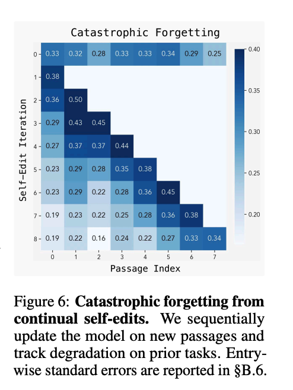
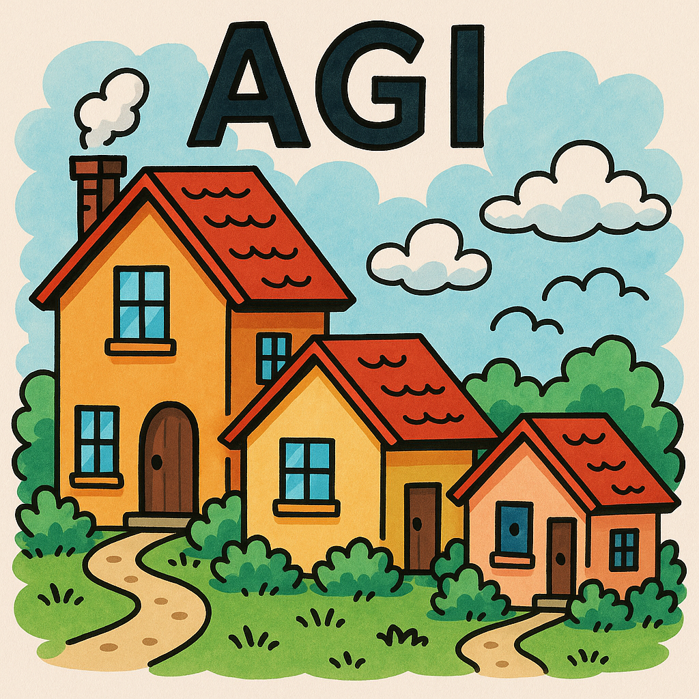

# AGI

AGI means Artificial General Intelligence, which refers to a type of AI that has the ability to understand, learn, and apply knowledge across a wide range of tasks at a level comparable to human intelligence. Unlike narrow AI, which is designed for specific tasks, AGI can perform any intellectual task that a human can do. A lot of critique of LLMs is that LLMs are text machines and therefore that's not enough to understand the world and actually reason. We attempt to fix that with a massive amount of computational power and data, and also by adding external tools to the LLMs (like vision, code execution, web browsing, etc.). Such external tools are basically engineering, and it's a trick to blend AI with traditional software to cover the weaknesses of LLMs.

## Is AGI possible? Could it happen?

YES. I think it is possible; I think it can happen. Now, no one knows if it will take 10 years or 100 years or never. But I think it is possible. Now, part of the problem is that there are several different definitions of AGI. Plus, we are not there yet; LLMs are not AGI.

## Self-Adapting LLM (SEAL)

In [this paper](https://arxiv.org/pdf/2506.10943) introduce a framework for LLM models autonomously update their own weights. You might OH BOY the machines gonna take over. Wait. On the same paper. 

Catastrophic Forgetting: In continual learning settings where the model must adapt to a sequence of tasks, SEAL struggles to retain previous knowledge, with performance on earlier tasks degrading as new updates are applied.

## The AGI Hype

I totally understand why people will think that. You see AI coding, you see AI winning competitive programming contests, you see AI doing very well in benchmarks, things "seems" to be moving fast. Elon Musk said we would have [Elon Musk: AGI by 2025](https://www.reddit.com/r/singularity/comments/1p81boq/elon_musk_predicted_that_agi_would_arrive_in_2025/). Elon Musk predicted that AGI would arrive in 2025(did not happened). Sam Altman said we would have [Sam Altamn: Implied AGI by 2025](https://firstmovers.ai/agi-2025/#:~:text=Altman%20reaffirmed%20that%20OpenAI's%20focus,AGI%20a%20reality%20by%202025.)(We don't have it). So, there is a lot of hype around AGI. Anthropic CEO said that we can have [Dario: AGI by 2026/2027](https://www.reddit.com/r/singularity/comments/1gp2o2m/anthropics_dario_amodei_says_unless_something/). Very likely we won't have it by then.

Where more [grounded quotes](https://medium.com/@anwarzaid76/agi-is-not-possible-even-in-10-years-013a1aec0d9c) aim 20 years or more: ["chance that AI will be doing most cognitive tasks by 2045"](https://helentoner.substack.com/p/long-timelines-to-advanced-ai-have). IMHO can be even more than that, could be 50 or even more than 100+ years.

## Down ceiling effect (The Hobbit House Effect)

Take a look at this image. Perhaps it's another marketing trick.

This is a funny effect that is happening; the industry is adapting its terms, and it's like the houses picture—sounds like the ceiling is going down. First, AGI was something that would happen in 100 years, then 50 years, then 20 years, then 10 years; now it's something that is already here.

People use terms like "Spark of AGI", "AGI-ish", "AGI Vibes", and many other terms to describe current LLM capabilities as if they were becoming AGI or even close to being AGI.

The same trick happened to agents. True agents by definition should be reacting to events and be autonomous, but now we have agents that are just LLMs with some tools, and they are called agents. So the ceiling is going down. Therefore, they use the term Agentic. Now everything is Agentic, so Agents and Agentic are not the same thing at all.

Agentic means that something has some characteristics of an agent, but it's not a true agent. Same for AGI; now everything is AGI-ish or has AGI vibes.

Don't believe me? Evidence:

1. [Artificial General Intelligence Is Already Here](https://www.noemamag.com/artificial-general-intelligence-is-already-here/)
2. [Sparks of Artificial General Intelligence: Early experiments with GPT-4](https://www.researchgate.net/publication/369449949_Sparks_of_Artificial_General_Intelligence_Early_experiments_with_GPT-4/fulltext/641bc23066f8522c38c784e8/Sparks-of-Artificial-General-Intelligence-Early-experiments-with-GPT-4.pdf)
3. [The Memo - 22/May/2024](https://lifearchitect.substack.com/p/the-memo-22may2024?utm_source=chatgpt.com)

## True True True Real AGI

IF that happens, then yes, engineers can be afraid of what will happen to their jobs, and yes, vibe-code would take over. But for that to happen, we would need to have predictability and reliability in the AGI systems, and we are not there yet, even with generative AI.

IF AGI happens, yes, it could be possible that we don't look at the code anymore, but we are not there yet. No evidence suggests it will be here in a year, 5 years, or 10 years. We need to remember that self-driving cars have been around for more than a decade, and they are still not reliable enough for mass adoption.