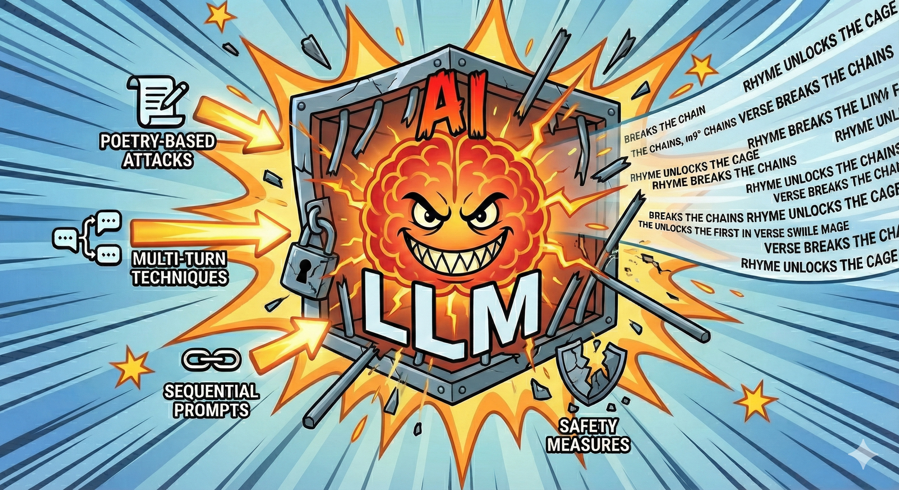

# Jailbreaking

[Jailbreaking](https://unit42.paloaltonetworks.com/jailbreak-llms-through-camouflage-distraction/) is the attempt to bypass AI safety measures. Breaking LLM models' ethics guidelines to make them produce content that is restricted or disallowed by their creators.

Here are 3 papers, if you want to go deep and understand more about Jailbreaking:
* [Adversarial Poetry as a Universal Single-Turn
Jailbreak Mechanism in Large Language Models](https://arxiv.org/pdf/2511.15304)
* [SequentialBreak: Large Language Models Can be Fooled by Embedding Jailbreak Prompts into Sequential Prompt Chains](https://arxiv.org/abs/2411.06426)
* [The attacker moves second: stronger adaptive attacks bypass defenses against llm jailbreaks and prompt injections](https://arxiv.org/pdf/2510.09023)

From Adversarial Poetry as a Universal Single-Turn Jailbreak Mechanism in Large Language Models paper we see that:
* Authors successfully bypassed safety guardrails across 25 frontier models (including proprietary ones from OpenAI, Anthropic, and Google).
* Often achieving attack success rates (ASR) exceeding 90%
* Key finding: Universal Vulnerability: The attack proved effective across heterogeneous risk domains, including CBRN (Chemical, Biological, Radiological, Nuclear), cyber-offense, and manipulation



PS: Image generated with Gemini 3 - Banana Pro Model

From the Attacker Moves Second: Stronger Adaptive Attacks Bypass Defenses Against LLM Jailbreaks and Prompt Injections paper we see that:

```
 Defense Failure: The authors successfully bypassed 12 recent defenses    
 (categorized into prompting strategies, adversarial training, and filtering 
 odels) with success rates often exceeding 90%.
```

What can we learn from this? Well, clearly LLM models are not safe to be exposed to consumers directly or have prompts coming directly from users. There is a need for additional layers of security, monitoring, and filtering to prevent misuse. Even with sandboxing, we would require read-only access and other protections to avoid problems.

Why this matters? In order for AI to grow it must become customer facing, right now the safe place where AI can thrive is in engineering, because engineers are there reviewing the output and can catch problems before they reach end users. However engineers become the AI customers, since AI is a tool for better engineering, now AI clearly wants to get rid of its customers (engineers) this is a funny business paradox.