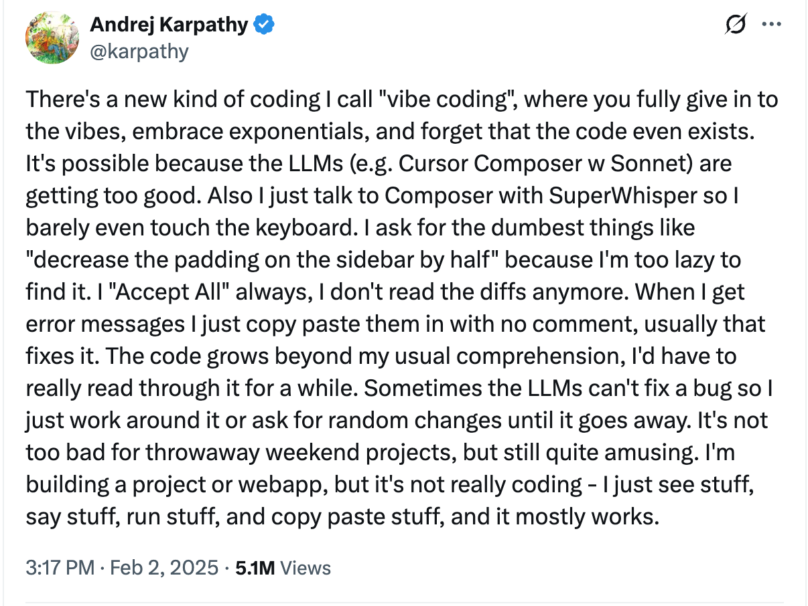

# Vibe Coding

Andrej Karpathy coined the term "vibe coding" in one of his [tweets](https://x.com/karpathy/status/1886192184808149383?lang=en) in February 2025.

Vibe coding is a practice where you generate prompts and `do not look at the code`. You assume AI will take care of everything. However that premise is wrong. AI does not get everything right. AI:
* Ignores your requests: You ask for Java 25, AI delivers Java 21.
* AI Hallucinates: And makes up APIs that don't exist or code that gives you bugs at runtime.
* AI Just ignores you: You ask for a specific library, AI just ignores it and uses something else.

Vibe coding is very much like trial-and-error, you can build games with it even but don't fool yourself you can't use vibe coding for all things. Not reading the code and not reading the DIFFs is an awful practice. Asking for random changes and hoping the bugs go away is not a strategy. Any serious software engineer with a brain will tell you that vibe coding is a bad idea.

## Where you can use vibe coding

* It's a small utility: It's very small, you would not do it, and it's not your core business. Example: A small script to convert CSV to JSON.
* It's for throw away discovery: You are prototyping something very fast, and you will throw away the code later.
* It's for learning: You are learning a new language or framework, and you want to get a feel for it quickly.

Considering those use cases, vibe coding is fine. However, I would need to say that for the last one you want to read the code. Therefore it's not vibe coding. Now, if you want to know whether something is possible and you are just aiming for feasibility, yes, you can vibe code it but throw it away after and do it right.

## Where you MUST NOT use vibe coding

To the point where you should `ban vibe coding`. Your CORE business should not be vibe coded. Vibe coding your core business is a recipe for disaster. If one day we get AGI then we can revisit this. One important note, people lie, and they will market anything as "AGI", so we might have AGI but it might not be what you think it will be. Meaning we still have jobs, this idea that AI will kill engineers jobs is absurd. Thank God at this point people are coming to their senses as the hype cycle with AI is going down.

Your CORE business is how you make money, it's your bread and butter. Who wants to kill your milk cow? No one. Therefore don't vibe code your core business. Because that's a recipe for disaster.

## Vibe Payments

Vibe Coding to some degree is a lack of respect. It's a lack of respect for people's entire careers and hard-working years in this profession. Vibe coding means you are not paying attention to the code. Think about this: if AI is doing everything, and you are not paying attention to the code, how much should you be paid? Or should you be paid the same thing every month? IMHO we need `Vibe Payments`. Vibe Coders should be paid with vibe payments. It would look like this:
* One month you get 50% less
* Another month you get 30% less
* Next month you get 20% more
* Another month is no payments
* Next time you owe -240% of your salary

You would not like it. But that did not stop you from throwing bad code at others. My friends, believe me, AI generates a lot of trash code. We need to do better.

## Vintage Coding

I run [coding dojos](https://codingdojo.org/) without AI for decades. A coding dojo is a space where senior engineers work with junior engineers, and they all learn from each other. Coding dojos follow [TDD](https://en.wikipedia.org/wiki/Test-driven_development) practices.

More importantly, coding dojos existed before AI. In a proper coding dojo, you don't use the "auto complete" features from your IDE; you type everything. Coding dojos should be done without AI, forcing you to think and be able to do things without AI. This I was calling "Vintage Coding" because now everybody does coding using AI. So having this practice where we can do coding without AI (by design) forces us to know our tools, and helps us with:
* Mastering our tools
* Being able to move fast without (consulting google or AI all the time) - no waiting
* Being able to quickly figure out solutions
* Improving our problem solving skills
* Improving our Data Structures and Algorithms game
* Improving attention to details

It's important to use AI to increase some productivity (which I think is something ballpark between 10-30% MAX). But it's also important to do the vintage coding (coding dojos) often, to keep us healthy and in shape. Like you go to the GYM because you are not a hunter and stay sitting in a chair all day long in zoom calls:-).

## How Do You Drive a Car?

I don't know about you but I just drive a car. I don't think. It's natural, it's organic. I don't need to make any effort—it's so easy. Now ask yourself: is this the same for you? You probably will say YES. Well, then we need to ask ourselves the next question: why? I'll tell you why.
* Because you pass the driver license exam
* You study the rules of the road
* You practice driving a lot (for years probably)

Now the effect is that you do that with such efficiency. Now, imagine if you we're driving a car and looking at the manual—literally, you have a thick book with rules, and while driving you check the manual every time:
* You need to turn left
* You need to turn right
* You need to stop at the red light
* You need to check the speed limit
* You need to backup

You will be such a terrible driver. I don't think anyone drives like this. Because we don't allow anyone to drive—there is a bar. But for engineering there is no bar. Anyone can do anything, even without being close to being qualified. Now I'm not advocating for extreme regulation of engineering. But what I'm saying is: imagine if I tell you that a huge number of programmers code like the driver I described. "Wow, no way Diego, this sucks!" Well, instead of the manual they we're using StackOverflow, and before that forums, and now, guess what? They are using LLMs and AI Agents.

We need to have proficiency!

## Zero to Demo vs Demo to Production

Vibe coding can be very useful for creating a DEMO. However putting software into production it's a whole different game.

Karpathy explains how he got a DEMO on waymo in 2014 and it was working. He thought it would be quick. More than 11 years later in 2025 Waymo is still not 100% done. Why? Because some tasks are hard and the gap between the demo and production is huge.

In the video below Andrej Karpathy explains it well:

<iframe src="https://www.youtube.com/embed/lXUZvyajciY?start=6228"
    title="Andrej Karpathy — "We're summoning ghosts, not building animals"" frameborder="0" allowfullscreen
    allow="accelerometer; autoplay; clipboard-write; encrypted-media; gyroscope; picture-in-picture"
    style="position: absolute; width: 100%; height: 100%;">
</iframe>

Vibe coding can be useful to figure out what we want. Maybe to help non-engineers to figure out what they want, then better write requirements. In a sense vibe coding "democratizes" building and everybody can be a software engineer,, however, to really use what you build with "vibe coding" must be some simple task, some tasks cannot be vibe coded and like I said before is a big mistake. However if it's small enough and you can "build your own tool" why not.