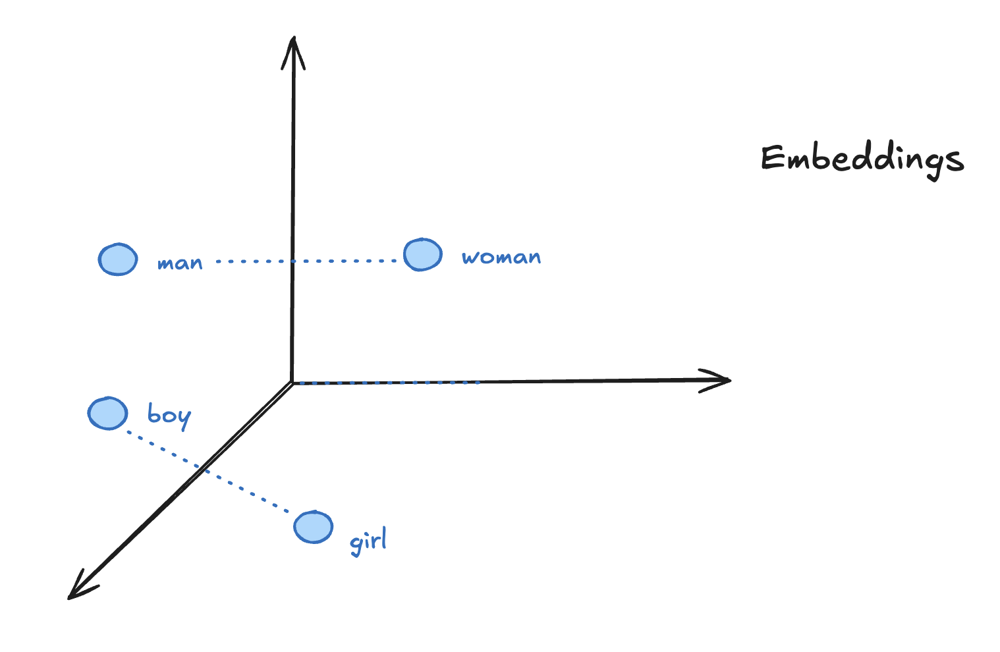

# Embeddings

Embeddings are a way to represent data, such as words, sentences, or images, as numerical vectors in a high-dimensional space. This representation allows AI models to understand and process the data more effectively.

By transforming text into numbers LLM can compare similarities between different pieces of text, using a similarity score based on the distance between their corresponding vectors in the embedding space. Comon similarity measures include [cosine similarity](https://en.wikipedia.org/wiki/Cosine_similarity) and [Euclidean distance](https://en.wikipedia.org/wiki/Euclidean_distance).