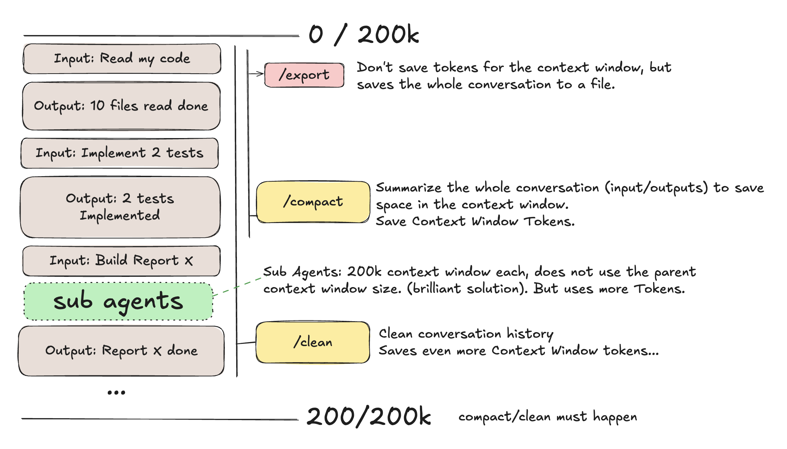

# Advanced Context Window Management

Claude code does a great job managing the context window. Claude code is not just a wrapper on the top of a LLM API but is also a blend between Generative AI and Engineering. Here is how Claude code manages the context window in an advanced way.

Right now Claude code has the limit of 200k tokens. Before this gets more confuse we need make the difference between 2 kinds of tokens, payable tokens and contect window tokens. IF you are in a subscription based plan you have a limit of tokens before you have some "cool down" period. If you use a payed API plan, you do not have such limit becaused you pay for token so this are payable tokens.

Now there is a different kind of token, which is the context window tokenes. Context window tokens not matter if you are in a flat fee subscript or api plan you will have a limit of 200k context windown tokens. If you look the image on the top I can explain some advanved magic claude code is doing.

First we need understand how the context window works, for all inputs and output tokens that is the conversation, it's always sucking context windown tokens. So the more questions you ask and the more anwsers you get more you are using of your context window. Eventually you will run out of context window tokens than claude will run an `compact` or `clean`. 

`/compact` will sumari the context window and and reduce the space used on the context window. You can see how the context window is looking like with `/context` command. If that is not enought claude will issue a `clean` which will clean the conversatio hidtory freeing up more context window tokens. You can run this commands anytime you want. You can also run anytime you want the command `/export` which will export the conversation in a file. This is useful because you can use the file for future prompts, as history or as a base for new conversations.

So claude code does a great job managing context window tokens for you. There is one more trick, which is the advent of [claude code sub-agents](https://code.claude.com/docs/en/sub-agents). The beauty of the sub-agents are 2 fold. First, each sub-agent has its own context window of 200k tokens. So if you have multiple sub-agents working for you, each one has its own context window. This is very useful because you can have different sub-agents working on different tasks without interfering with each other. Sub-agents do not use the parent context window tokens. Second, sub-agents can be spawned and killed at will. Claude can figure out you need sub-agent for a specific task, will spawn it, use it, and then kill it when you are done. This way you can manage your context window tokens even more efficiently.