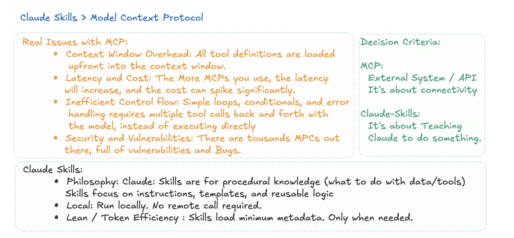

# Claude Skills

MCP has several issues, like context overhead, [lack of proper security](https://astrix.security/learn/blog/state-of-mcp-server-security-2025/) and guardrails. MCPs can be local or can be remote. MCPs was create by Anthropic, others follow and become a huge thing. Well huge in the sense of many many MCPs out there but adoption at enterprise or at scale companies, not so really.

[Claude-skills](https://www.claude.com/blog/skills-explained) have the potenrial to reduce a great deal of the MCP issues and even market share, [Claude-Skills are a big deal](https://simonwillison.net/2025/Oct/16/claude-skills/). Anothropic already have a [repository for claude-skills](https://github.com/anthropics/skills) and [awesome-skills](https://github.com/ComposioHQ/awesome-claude-skills/) too.

## The Issue with MCPs

It's that we are throwing all the data up to front on the context window, which is limited. Remeber when we do `/context` we can see the context window used. This is not scalable. Because what IF claude never use the MCP you add there? You just such space on the context window for nothing. Also every MCP is throw lot of text into the context window, which is not efficient.

So MCP in a nutshell it's throw a lot of data into the LLM and hope it will use it.

## How Claude Skills Work

Claude skill works fundamentally different. Instead of throwing all the data into the context window, Claude skills are more like API calls. You define a skill, which is a specific function or capability that Claude can use. When Claude needs to perform a task that requires that skill, it makes a call to the skill, passing only the necessary information.

[Claude skills (or Agent skills)](https://claude.com/blog/skills) are CODE. thats funny isin't it? We use to write all the code, now AI write the code for us, and now we write code for AI so AI know how to better write code. But the idea of Claude-Skills is brilliant, basicaly there is a simple file like `skill.md` where there just a couple of example for claude on how to use the code. Them you ship a script which has the recipe on how to do the task. When Claude need to do the task, it call the skill, passing only the relevant data. The shift here is huge, we are not throwing a lot of data into claude anymore(MCP) we are actually teaching how how to do something(as the name says hence a "skill") which is all about coding and programing languages.

Code is great, code is predictable and reliable(all that generattive AI and LLMs are not), so Code is a great solution to the MCP issues. Also there is a non-obvious thing going on here which is, with claude-skills you are not downloading the skills from some random dude on github, you are crteating the skills by yourself with or without help from claude, by nature is more secure and FTEs writting code is more realible and "secure" than random MCP from some dude on the internet.

Here is a simple example of claude-skill a built to [format JSON](https://github.com/diegopacheco/ai-playground/tree/main/agents/claude-code/claude-skill-fun).

## When we would still use MCP?

Well, with claude skills a great share of MCP can be gone and now we can have MCP for remote use cases, you wont be able to run AWS claude in your machine, or you will have external services like Figma, Jira, Salesforce, etc. So MCP will be more for [remote use cases](https://blog.christianposta.com/mcp-authorization-patterns-upstream-api-calls/) and claude-skills for local use cases.

## Summary

source: [https://x.com/diego_pacheco/status/1989959020032266435](https://x.com/diego_pacheco/status/1989959020032266435)