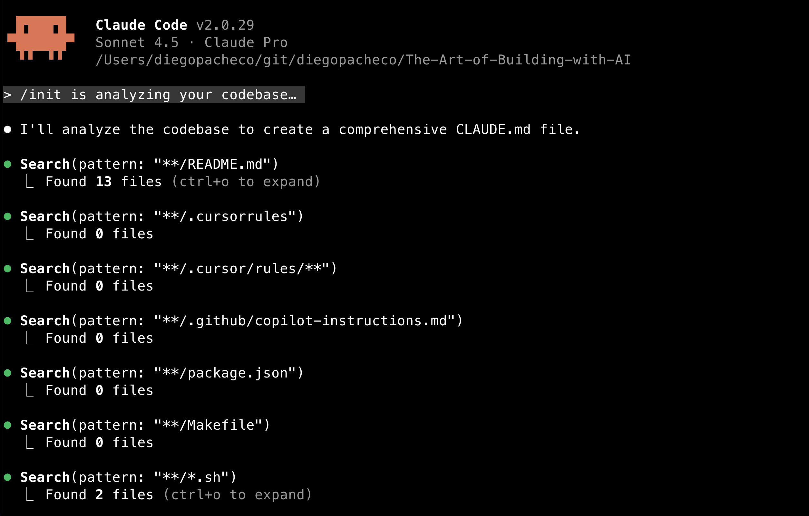
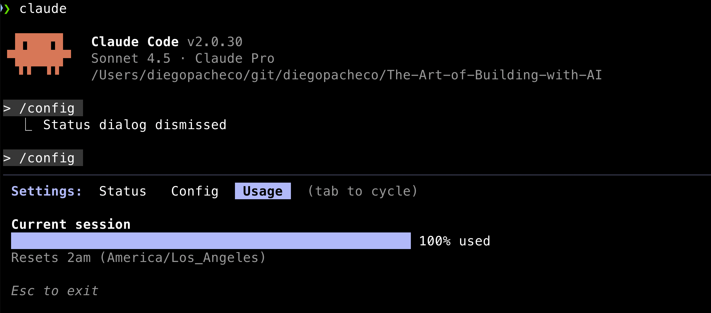

# Commands

Let's explore claude code [commands](https://docs.claude.com/en/docs/claude-code/slash-commands.md).

## /init

Once you start a project with claude code, you run `/init`. Claude will read the whole codebase and create a file in your project called `CLAUDE.md` in the project path.



The resulting `CLAUDE.md` will vary depending on the project, but likely to contain:
- Project overview
- Build and serve instructions
- Version management details
- Content structure explanation
- Configuration information

`CLAUDE.md` works as a form of cache so claude doesn't need to read all the codebase all the time to figure out this information. Because:
* Claude code has no memory between sessions
* Reduce the amount of tokens used in each interaction
* Prevents some guessing from claude

`CLAUDE.md` is documentation for AI not for humans. You should run this program every time you start a new project with claude code.

## /context

This command allow you to see where claude code is using context from. It shows the files claude code has read to answer your questions.


Why this is useful?
* Transparency: You can see exactly which files influenced the AI's response.
* Diagnostics:  See if you're running out of space.
* Debug: You can see what is being loaded to claude memory.

You should run this program time to time to see how the context is being used.

## /clear

This command clear the conversation history with claude code. It will remove all the messages exchanged in the current session.

## /compact

This command will compact the context used by claude code. It will remove some of the less relevant files from the context to make space for new files.

## /bashes

List all background bashes that claude code has run in the current session.

## /cost

Show the cost of the current session. Only works if you are using an API key based subscription, either directly with Anthropic or via AWS Bedrock. If you are using a subscription based on messages, this command will not display anything useful.

## /doctor

Will run diagnostics on the claude code installation. You will see an output like this:
```
> /doctor

 Diagnostics
 └ Currently running: npm-global (2.0.30)
 └ Path: /Users/diegopacheco/.nvm/versions/node/v24.7.0/bin/node
 └ Invoked: /Users/diegopacheco/.nvm/versions/node/v24.7.0/bin/claude
 └ Config install method: global
 └ Auto-updates enabled: default (true)
 └ Update permissions: Yes
 └ Search: OK (vendor)
```

## /export

Will export the current session chat history to a file. This command is very useful. Here is an example of the output:

```
❯ cat  2025-10-30-caveat-the-messages-below-were-generated-by-the-u.txt

 ▐▛███▜▌   Claude Code v2.0.30
▝▜█████▛▘  Sonnet 4.5 · Claude Pro
  ▘▘ ▝▝    /Users/diegopacheco/git/diegopacheco/The-Art-of-Building-with-AI

> /config
  ⎿  Status dialog dismissed

> /config
  ⎿  Status dialog dismissed

> /bashes
  ⎿  Background tasks dialog dismissed

> /cost
  ⎿  With your Claude Pro subscription, no need to monitor cost — your subscription includes Claude Code usage

> /doctor
  ⎿  Claude Code diagnostics dismissed
  
```

## /config

Allows you to configure several aspects of claude code. Like: If you want claude to auto-compact or not, if claude should show tips or not, what theme you want in the terminal, the output style, what LLM model to use, to have code rewinding enabled or not, among other options.

If you use a subscription-based plan, you can see a progress bar of how much of your tokens quota you have used. Also when the reset will happen.



## /agents

Lists all the agents you have created. Also allows you to create new agents, edit existing agents or delete agents.


When you create a new agent, what claude code will do is to create a new folder under the path `~/.claude/agents/AGENT_NAME.md` with all the files needed to run the agent.

Claude Code can generate the agent markdown file based on a prompt you will provide. You can edit the agent.md file later as well.