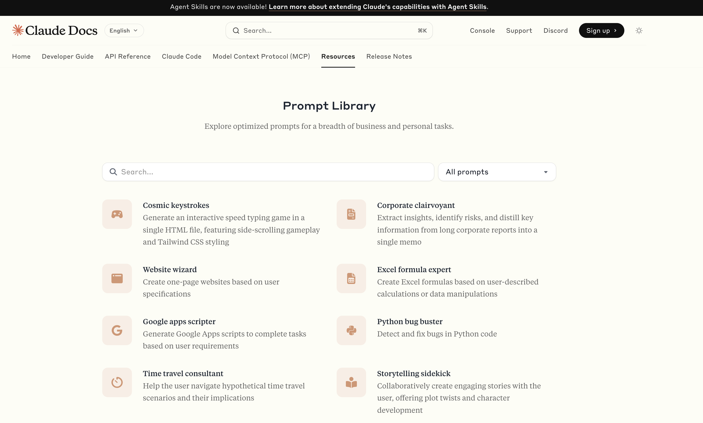

# Prompt Library

Claude Code has a prompt library. When you have a powerful LLM, sometimes the GAP is not using the LLM, but knowing how you can use the LLM, meaning what things the LLM can do. So you need to learn which questions to ask; sometimes these questions are called "prompts".

[Claude Prompt Library](https://docs.claude.com/en/resources/prompt-library/library) is a list of questions or prompts, if you will, that allow you to see things Claude can do.

