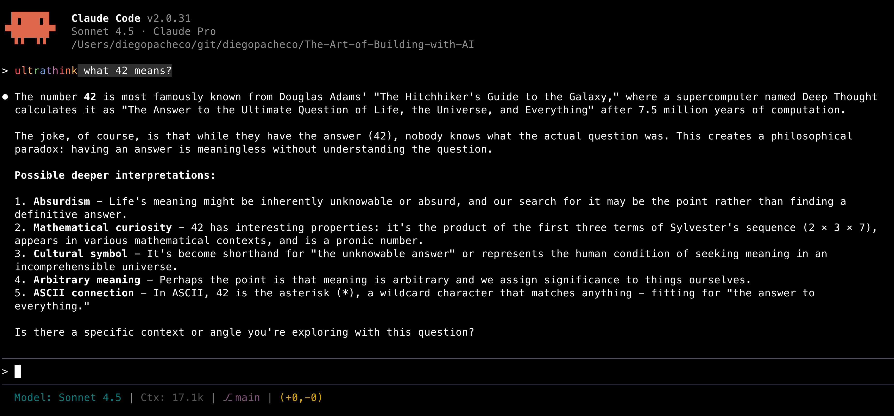

# ultrathink

ultrathink is an instruction you give to Claude Code that makes it think more deeply about the problem at hand. It encourages the model to take extra time to analyze the situation, consider multiple perspectives, and generate more thorough and well-reasoned responses.



The moment you type ultrathink, you will see Claude highlight the word "ultrathink" with one color per letter, explaining that Claude will behave differently now.

I asked Claude Code the difference between normal "Thinking mode on" and "ultrathink" and this is what I got:
```
Normal "Thinking On" Mode

- Claude shows brief internal reasoning between actions
- Thinking appears in short blocks as Claude works
- Uses a standard token budget for reasoning
- Good for general tasks and problem-solving

Ultrathink Mode

- Extended thinking with a much larger token budget (up to 10,000+ tokens)
- Claude spends significantly more time reasoning before responding
- Better for highly complex problems like advanced math, coding, and deep analysis
- Higher latency and cost due to extensive reasoning
- Claude can reason through multiple approaches and self-correct
```